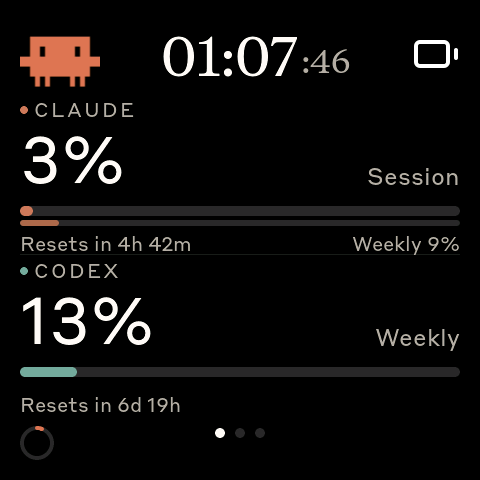
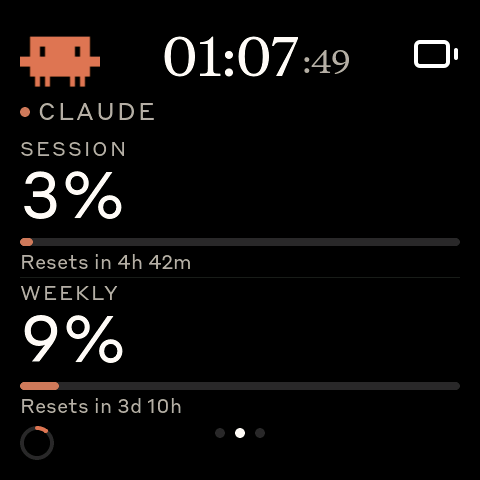

# Agentmeter

A desk-side AI usage monitor for ESP32 AMOLED boards. It polls the Anthropic and
OpenAI/Codex APIs directly over Wi-Fi and shows how much of each rate-limit
window you have left. No host PC, no daemon.

| Overview | Per-provider |
|---|---|
|  |  |

Swipe left/right for a card per provider, up/down to page through the overview.

## Hardware

**Waveshare ESP32-S3-Touch-AMOLED-2.16** (verified). The 1.8" S3 build works;
the ESP32-C6 builds compile but are unsupported — no PSRAM, and TLS runs out of
internal memory. See [`docs/porting/`](docs/porting/) to add a board.

## Install

```bash
./setup.sh                    # installs PlatformIO if needed, picks a board, flashes
```

Or manually, with [PlatformIO](https://platformio.org/):

```bash
pio run -d firmware -e waveshare_amoled_216 -t upload --upload-port /dev/ttyACM0
```

Port is `/dev/ttyACM0` on Linux, `/dev/cu.usbmodem*` on macOS.

## Setup

1. On first boot the device starts a Wi-Fi hotspot — join it and enter your
   network credentials.
2. Once it's on your network, open the config page shown on the device's Wi-Fi
   screen (`http://agentmeter.local`, or the IP it displays).
3. The page is locked. Enter the 8-character code shown on the device to unlock
   it — so only someone who can see the panel can change settings. It stays
   unlocked for 30 minutes.
4. Paste your API credentials and save. Changes apply immediately.

> Credentials are stored unencrypted in flash, and the config page — including
> the code and session cookie — is plain HTTP. It's a personal desk device;
> don't put it on a network you don't trust.

## Development

```bash
pio run -d firmware -e waveshare_amoled_216   # build
pio test -d firmware -e native                # parser tests
./screenshot.sh out.png                       # capture the live screen over USB
```

Serial commands over USB: `screen <name>`, `tile <col> [page]`, `screenshot`,
`bench`, `lvmem`.

[`docs/hardware-notes.md`](docs/hardware-notes.md) covers the constraints worth
knowing before changing anything: the device is out of internal RAM, which is
what caps provider count and frame rate.

## Credits

Built on [HermannBjorgvin/Clawdmeter](https://github.com/HermannBjorgvin/Clawdmeter)
(the original device), via [alasdaircs/clawdmeter-wifi](https://github.com/alasdaircs/clawdmeter-wifi)
(Wi-Fi rearchitecture) and [r-x105/clawdmeter-wifi](https://github.com/r-x105/clawdmeter-wifi).
The board HAL, splash animations, fonts and BLE HID keyboard come from that
lineage. Provider scope inspired by
[steipete/CodexBar](https://github.com/steipete/CodexBar).
Splash art from [claudepix](https://claudepix.vercel.app).
